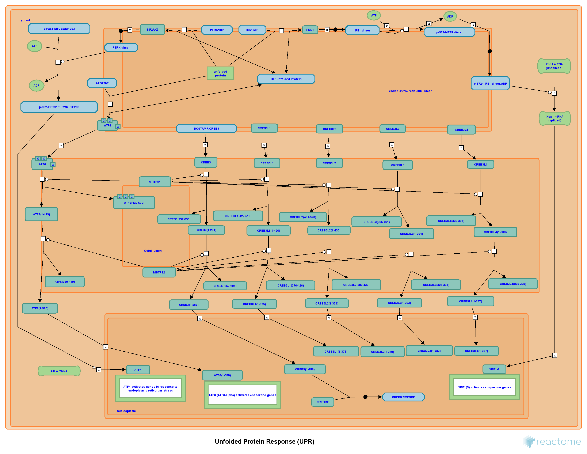

# Overview

```{r a2_source, include=FALSE,echo=FALSE, message=FALSE}
options(warn=-1)
a2_output <- knitr::knit_child('assignment2.Rmd', quiet = TRUE)
# run the garbage collector
gc()
```

In the previous two assignments, we obtained data associated with the study **Cannabidiol inhibits SARS-CoV-2 replication through induction of the host ER stress and innate immune responses** and conducted thresholded differential gene expression analysis. We obtained the dataset from GEO with ID GSE168797, associated with the study Cannabidiol inhibits SARS-COV-2 replication and promotes the host innate immune response published on Science Advances. Out of the total of 57832 genes, 13705 remained after removing low counts and genes with duplicate identifiers. The top terms associated with the upregulated genes returned from the thresholded analysis using g:profiler are response to endoplasmic reticulum stress, proteasomal protein catabolic process, ERAD (Endoplasmic-reticulum-associated protein degradation) pathway; the top terms associated with the downregulated genes are mitotic nuclear division, chromatin binding, cell cycle.

The authors hypothesized and concluded that cannabidiol inhibits SARS-CoV-2 replication by up-regulating the host IRE1α ribonuclease endoplasmic reticulum (ER) stress response and interferon signaling pathways.

In this assignment, we will further investigate differential gene expression and attempt to discover and learn more about the pathways involved in CBD's suggested antiviral effect against SARS-CoV-2. In particular, we will use non-thresholded gene enrichment analysis to obtain a more diverse portfolio of differentially expressed genes. The results from non-thresholded analysis will also serve as comparison to the results from the previously done thresholded analysis. Ideally, the non-thresholded analysis results further strengthen the plausibility of our previous results and the authors' hypothesis in the original publication. Using the results obtained from the non-thresholded analysis, we will create an enrichment map network and conduct further analysis using the network.

## Import Packages

```{r a3_import}
if (!requireNamespace("RCurl", quietly = TRUE))
  install.packages("RCurl")
library("RCurl")

if (!requireNamespace("reshape2", quietly = TRUE))
  install.package("reshape2")

if (!requireNamespace("RCy3", quietly = TRUE))
  BiocManager::install("RCy3")

# high-res figures
knitr::opts_chunk$set(dpi=600,fig.width=7)
```

Helper functions for obtaining the GMT files and running GSEA.

```{r file_helper}
fileExists_wildcard <- function(pattern, dir) {
  # check if there is any file matching the pattern (regex)
  return(length(grep(pattern, list.files(dir))) > 0)
}

folderExists_wildcard <- function(pattern, dir) {
  # check if there is any file matching the pattern (regex)
  return(length(grep(pattern, list.dirs(dir, recursive = FALSE))) > 0)
}
```

```{r gsea_cmd}
run_gsea <- function(gsea_jar, rnk, gmx, nperm, max_termsize, min_termsize, out_dir, rpt_label) {
  command <- paste(
    gsea_jar, 
    "GSEAPreRanked -gmx", gmx, 
    "-rnk", rnk, 
    "-nperm", nperm, 
    "-set_max", max_termsize, 
    "-set_min", min_termsize, 
    "-out", out_dir,
    "-rpt_label", rpt_label,
    "> gsea_out.txt",
    sep = " ")
  if (!folderExists_wildcard(rpt_label, "gsea_out"))
    system(command)
  else
    print("GSEA results already exists; remove previous result or use a different job name to continue.")
}
```

```{r get_gmt_helper}
getGMT <- function(src, pattern) {
  gmt_url <- src

  filenames = getURL(gmt_url)
  textConn = textConnection(filenames)
  contents = readLines(textConn)
  close(textConn)
  
  # filter out the filenames using the regex pattern
  rx = gregexpr(pattern, contents,
                perl = TRUE)
  
  gmt_file <- unlist(regmatches(contents, rx))
  
  # download the gmt file if there is no file with extension .gmt in the gmt folder
  if (!fileExists_wildcard(".gmt", "gmt"))
    download.file(paste(gmt_url, gmt_file, sep = ""), destfile = file.path(getwd(), "gmt", gmt_file))
}
```

# Non-thresholded Gene Enrichment Analysis

## Create Ranked List

To perform a non-thresholded gene enrichment analysis, we use GSEA. But before we do that, we first create a ranked list using the set of all differentially expressed genes obtained in Assignment 2.

```{r ranked_list_display_original}
diff_exp_lst
```

Recall that rank can be calculated using the following formula
$$
\mathrm{rank} = \mathrm{sign}(\mathrm{logFC}) \cdot(-\log_{10}p)
$$

```{r ranked_list_create}
# calculate ranks
ranks <- sign(diff_exp_lst$logFC) * -log10(diff_exp_lst$PValue)

# store the ranks along with gene names
rank_list_gene_names <- diff_exp_lst$hgnc_symbol
rank_list <- cbind(rank_list_gene_names, ranks)

# sort the ranked list
rank_list <- rank_list[order(as.numeric(rank_list[,2]), decreasing = TRUE), ]
colnames(rank_list) <- c("GeneName", "rank")

# store the ranked list
write.table(rank_list, file.path(getwd(), "CBD_vs_Veh_ranks.rnk"),
            col.names = TRUE, sep = "\t", row.names = FALSE, quote = FALSE)

kable(head(rank_list), caption = "Table 1: Top genes in the ranked list") %>% kableExtra::kable_styling("striped")
```

## Download Gene Sets

For this analysis, we will use the gene sets available at Bader's Lab

```{r get_gmt}
getGMT(
  src = "http://download.baderlab.org/EM_Genesets/current_release/Human/symbol/",
  pattern = "(?<=<a href=\")(.*.GOBP_AllPathways_no_GO_iea.*.)(.gmt)(?=\">)"
)
```

The gene set we used for this analysis is "Human_GOBP_AllPathways_no_GO_iea_April_01_2022_symbol.gmt" from Bader's lab. The "no_GO_iea" tag in the file name indicates that the gene set does not include genes inferred from electronic annotation.

## Analysis using GSEA

Next, we run GSEA from the command line. Note that the GSEA jar is stored at "GSEA_4.2.4/". If you have the GSEA jar stored at a different location, change the `gsea_jar` parameter to point to the correct location.

```{r run_gsea}
## function that reports that GSEA does not exists and terminate the knitting of the current notebook
reportGseaDNE <- function() {
  print("GSEA not found")
  knitr::knit_exit()
}
# check if GSEA directory exists
if (folderExists_wildcard("GSEA_*", "~")) {
  # get the GSEA installation (version independent)
  gsea_dir = list.dirs("~", recursive = FALSE)[grep("GSEA_*", list.dirs("~", recursive = FALSE))]
  if (length(gsea_dir) > 0) {
    gsea_path = file.path(gsea_dir[1], "gsea-cli.sh")
    # if the shell script exists, then execute GSEA command
    if (file.exists(gsea_path)) {
      run_gsea(
        gsea_jar = gsea_path,
        rnk = file.path(getwd(), "CBD_vs_Veh_ranks.rnk"),
        gmx = file.path(getwd(), "gmt", "Human_GOBP_AllPathways_no_GO_iea_April_01_2022_symbol.gmt"),
        nperm = 1000,
        max_termsize = 200,
        min_termsize = 15,
        out_dir = file.path(getwd(), "gsea_out"),
        rpt_label = "CBD_vs_Veh_GSEAAnalysis")
    }
    else
      reportGseaDNE()
  } else
    reportGseaDNE()
  
} else {
  reportGseaDNE()
}
```

After running the previous block successfully, we would have the GSEA result stored at the folder `gsea_out/CBD_vs_Veh_VSEAAnalysis.GseaPreranked.xxx`. We can pull the report for the positive and negative classes.

```{r get_gsea_result}
gsea_folder_names <- list.dirs("gsea_out", recursive = FALSE)[grepl("CBD_vs_Veh_GSEAAnalysis", list.dirs("gsea_out", recursive = FALSE))]
gsea_folder_name <- gsea_folder_names[1]
gsea_job_id <- tail(strsplit(gsea_folder_name, "\\.")[[1]], n = 1)

gsea_pos <- read.csv(file.path(gsea_folder_name, sprintf("gsea_report_for_na_pos_%s.tsv", gsea_job_id)), sep = "\t")
gsea_neg <- read.csv(file.path(gsea_folder_name, sprintf("gsea_report_for_na_neg_%s.tsv", gsea_job_id)), sep = "\t")
```

We would like to parse the rows in the GSEA report so that it is more readable.

```{r parse_gsea_name_col}
# parse the NAME column in GSEA output (split by '%')
parseGseaName <- function(gsea_table) {
  splitted_names = reshape2::colsplit(gsea_table$NAME, '%', names = c("description", 'src', 'id'))
  return(cbind(gsea_table, splitted_names))
}

gsea_pos <- parseGseaName(gsea_pos)
gsea_neg <- parseGseaName(gsea_neg)

kable(head(gsea_pos[,c("description", "src", "SIZE", "NES", "ES")]), caption = "Table 2: Top terms of upregualted genes") %>% kableExtra::kable_styling("striped")

kable(head(gsea_neg[,c("description", "src", "SIZE", "NES", "ES")]), caption = "Table 3: Top terms of downregulated genes") %>% kableExtra::kable_styling("striped")
```
We also present the enrichment plots for some of the top terms associated with the upregulated genes.


<br>


The top terms associated with the upregulated genes are all related to ER stress response and more interestingly, unfolded protein response. In particular, ERAD (ER assocaited protein degradation) pathway is also one of the top terms. Those pathways and mechanisms are also discussed in the literature. We will explore those pathway using network analysis in the next section.

## Discussion

1. For this analysis, I used GSEA version 4.2.3. I used the GSEA preranked analysis in GSEA. The geneset used was obtained from Bader's lab's repository. The code for obtaining the geneset is shown above. The geneset is created on April 1, 2022. The geneset is curated from GO, GOBP, MSigdb, Reactome, WikiPathways, NetPath, Panther, and HumanCyc.

2. In the enrichment result, the positive phenotype are the samples treated with CBD, and the negative phenotype are the ones without CBD treatment. 1064 / 2059 gene sets are upregulated in the positive samples, and 995 / 2059 gene sets are upregulated in the negative samples. In the positive phenotype, 217 gene sets are significantly enriched at nominal pvalue < 1%; in the negative phenotype, 342 gene sets are significantly enriched at nominal pvalue < 1%. The top terms associated with the positive samples are: RESPONSE TO ENDOPLASMIC RETICULUM STRESS (GO), UNFOLDED PROTEIN RESPONSE (UPR) (Reactome), IRE1ALPHA ACTIVATES CHAPERONES (Reactome). The top terms associated with the negative samples are: NUCLEAR CHROMOSOME SEGREGATION, CHROMOSOME SEGREGATION, SISTER CHROMATID SEGREGATION, all from GOBP.

3. The results from non-thresholded analysis using GSEA is very similar to the result obtained from the previous analysis using G:profiler. The upregulated genes are mostly related to ER stress response and protein degradation whereas the donwregulated genes are mostly related to cell cycle regulation and cell divisions. However, overall, the terms from the results using GSEA is more diverse. This is because GSEA is not a thresholded method and it gets to consider all genes instead of just those passed the threshold in thresholded methods. Although the top terms are mostly the same, this is not a straightforward comparison because the two methods (GSEA v.s. G:profiler) uses different approaches. The similarity in the the top terms is likely attributed to the significant overrepresentation of certain genes. This also gives us strong evidence to believe that the differentially expressed genes are more likely than not to be involved in these pathways.

# Network Analysis Using Cytoscape

## Creation of Enrichment Map

In this section, we will import the results from GSEA into Cytoscape and visualize the enrichment results as a network. To this end, we first need to create a network based on the enrichment result. We use the Cytoscape plugin EnrichmentMap, which can generate a network from GSEA outputs.

We created the enrichment map by using the Cytoscape GUI. We first imported the GSEA output for positive and negative phenotypes. Then, we imported the GMT file and ranked list file. Finally, we inspected and changed the parameters for Enrichment map. The thresholds for EnrichmentMap are as follows:

- FDR q-value cutoff: 0.1
- p-value cutoff: 0.05
- Edge cutoff: 0.375
- Edge filtering metric: Jaccard+Overlap combined
- Parse baderlab names in GMT file: True (for better readability)

Recall that Jaccard metric measures the intersection over union whereas the overlap metric measures intersection over the minimum size.

The resulting network is shown below:


A zoomed in view of the cluster of terms associated with ER stress response and unfolded protein response. These are the clusters that we will further investigate.


## Network Annotation

Next, we annotated the network using the plugin AutoAnnotate. For AutoAnnoate, we used the default parameter:
- Labeling algorithm: WordCloud Adjacent Word
- Max word per label: 3
- Min word occurrence: 1
- Adjacent word bonus: 8

Additionally, we turned on the option "Layout network to prevent cluster overlap" so that the resulting annotated network is more clear and easy-to-read.

The resulting annotated network is shown below.


## Summary Network

We collapsed the annotated network into a summary network using the built-in feature provided by AutoAnnotate.


The major themes in the analysis are:

- ER stress (upregulated)
- Protein degradation (upregulated)
- Immune response (upregulated)
- Protein folding (upregulated)
- Cell cycle (downregulated)
- DNA repair (downregulated)

The upregulated pathways fit the model and agree with the results by the authors of the original publication. The authors did not mention too much about the negatively regulated pathways. They are not necessarily novel but nonetheless worth futher investigating.

## Discussion

Discussion questioned answered in the previous subsections.

## Publication-ready Figure


(Unfortunately, resolution of figures is a little bit low and the DPI option does not seem to work. Please refer to journal for higher resolution figures.)

# Final Discussion

1. The enrichment results suppor the conclusions and mechanism discussed in the original paper. The results do not differ significantly from those from Assignment 2.

2. The involvement of the genes in ER stress response and the mechanism of unfolded protein response pathway are discussed extensively in (2008) Eizirik et al. and (2005) Credle et al. The mechanism discussed in these papers also agree with the proposed mechanism of CBD's antiviral effect discussed by in the original paper and the results obtained in this analysis.

# Analysis of UPR Pathway

We further investigate the unfolded protein response pathway. The pathway is of particular interest because the authors proposed this as the potential mechanism for the antiviral effect of CBD. This pathway is available on Reactome. Here is a detailed pathway diagram obtained from Reactome.



Export the normalized count file (with HGNC symbol annotation) for annotation on Reactome pathway diagram.

```{r export_normalized_count_annotated}
write.csv(normalized_counts_annot[3:14], file = "normalized_count_annotated.txt")
write.csv(qlf_diff_exp$table, file = "qlf_diff_exp.txt")
```

The expression data is uploaded to the online analysis tools provided by Reactome. Below is the resulting pathway diagram with the genes in the pathway colored based on their level of differential expression (log FC). As shown in the figure, the majority of genes in this pathway are upregulated although a handful are also downregulated. Unfortunately, the built-in tool in Reactome does not allow us to annotate the pathway with p-value or the acutal numerial logFC value.


We repeat a similar analysis using Cytoscape. This time, we use the expression data obtained in A2. This file includes not only the logFC but also the p-values for each differentially expressed gene. After importing the Reactome pathway into Cytoscape, we write an automation script to annotate the network using logFC and p-values:

```{r reactome_annotate, eval=FALSE}
nodes <- RCy3::getAllNodes()
attrib_table <- RCy3::getTableColumns()
for (n in nodes) {
  npos = RCy3::getNodePosition(node.names = n)
  attrib = attrib_table[attrib_table$name == n,]
  if (!is.null(attrib$logFC)) {
    RCy3::addAnnotationText(text = sprintf("logFC = %.2f", attrib$logFC), x.pos = npos$x_location, y.pos = npos$y_location)
    RCy3::addAnnotationText(text = sprintf("p = %.2g", attrib$PValue), x.pos = npos$x_location, y.pos = npos$y_location + 12)
  }
}

```

This script was run outside the notebook. It is shown here for demonstration purpose only.

The final annoated network is annoted with logFC and p-values. The color of each node corresponds to log fold change (red = upregulated, blue = downregulated) and the size of each node is inverse proportional to the p-value of the gene represented by the node.


As shown in the figure above, we can see the genes involved in the unfolded protein response pathway are mostly significantly upregulated. This is consistent with the finding in the original publication. The authors further confirmed this by observing the effect on SARS-CoV-2 infection in cells with the ERN1 gene (one of the gene involved in this pathway) knocked out. Their experiment shows reduced antiviral effects even with CBD treatment in ERN1 knockout cells.

# Journal

Link to my journal entry for this assignment: https://github.com/bcb420-2022/Kevin_Gao/wiki/Assignment-3

# Reference

Isserlin, R. (n.d.). Enrichment Map Analysis Pipeline. Bader Lab GitHub.

Kucera, M., Isserlin, R., Arkhangorodsky, A., & Bader, G. D. (2016). AutoAnnotate: A Cytoscape app for summarizing networks with Semantic Annotations. F1000Research, 5, 1717. https://doi.org/10.12688/f1000research.9090.1


Reimand, J., Isserlin, R., Voisin, V., Kucera, M., Tannus-Lopes, C., Rostamianfar, A., Wadi, L., Meyer, M., Wong, J., Xu, C., Merico, D., & Bader, G. D. (2019). Pathway enrichment analysis and visualization of OMICS data using G:Profiler, GSEA, Cytoscape and EnrichmentMap. Nature Protocols, 14(2), 482–517. https://doi.org/10.1038/s41596-018-0103-9

Chen Y, Lun ATL, Smyth GK (2016). From reads to genes to pathways: differential expression analysis of RNA-Seq experiments using Rsubread and the edgeR quasi-likelihood pipeline. F1000Research 5, 1438

Durinck, S., Spellman, P. T., Birney, E., & Huber, W. (2009). Mapping identifiers for the integration of genomic datasets with the R/Bioconductor package biomaRt. Nature - protocols, 4(8), 1184–1191. https://doi.org/10.1038/nprot.2009.97
Martin Morgan (2021). BiocManager: Access the Bioconductor Project Package Repository. R package version 1.30.16. https://CRAN.R-project.org/package=BiocManager

McCarthy DJ, Chen Y and Smyth GK (2012). Differential expression analysis of multifactor RNA-Seq experiments with respect to biological variation. Nucleic Acids Research 40, 4288-4297

Nguyen, L. C., Yang, D., Nicolaescu, V., Best, T. J., Ohtsuki, T., Chen, S.-N., Friesen, J. B., Drayman, N., Mohamed, A., Dann, C., Silva, D., Gula, H., Jones, K. A., Millis, J. M., Dickinson, B. C., Tay, S., Oakes, S. A., Pauli, G. F., Meltzer, D. O., … Rosner, M. R. (2021). Cannabidiol inhibits SARS-COV-2 replication and promotes the host innate immune response. Science Advances. https://www.science.org/doi/abs/10.1126/sciadv.abi6110
Robinson MD, McCarthy DJ and Smyth GK (2010). edgeR: a Bioconductor package for differential expression analysis of digital gene expression data. Bioinformatics 26, 139-140

Gu, Z. (2016) Complex heatmaps reveal patterns and correlations in multidimensional genomic data. Bioinformatics.

Kolberg L, Raudvere U, Kuzmin I, Vilo J, Peterson H (2020). “gprofiler2- an R package for gene list functional enrichment analysis and namespace conversion toolset g:Profiler.” F1000Research, 9 (ELIXIR)(709). R package version 0.2.1.

Stefan Milton Bache and Hadley Wickham (2020). magrittr: A Forward-Pipe Operator for R. https://magrittr.tidyverse.org, https://github.com/tidyverse/magrittr.
van Breemen, R. B., Muchiri, R. N., Bates, T. A., Weinstein, J. B., Leier, H. C., Farley, S., & Tafesse, F. G. (2022). 

Cannabinoids Block Cellular Entry of SARS-CoV-2 and the Emerging Variants. Journal of natural products, 85(1), 176–184. https://doi.org/10.1021/acs.jnatprod.1c00946

Fabregat A, Sidiropoulos K, Viteri G, Marin-Garcia P, Ping P, Stein L, D'Eustachio P, Hermjakob H. Reactome diagram viewer: data structures and strategies to boost performance. Bioinformatics (Oxford, England). 2018 Apr;34(7) 1208-1214. doi: 10.1093/bioinformatics/btx752. PubMed PMID: 29186351. PubMed Central PMCID: PMC6030826.

Eizirik, D. L., Cardozo, A. K., & Cnop, M. (2008). The role for endoplasmic reticulum stress in diabetes mellitus. Endocrine reviews, 29(1), 42–61. https://doi.org/10.1210/er.2007-0015

Credle, J. J., Finer-Moore, J. S., Papa, F. R., Stroud, R. M., & Walter, P. (2005). On the mechanism of sensing unfolded protein in the endoplasmic reticulum. Proceedings of the National Academy of Sciences of the United States of America, 102(52), 18773–18784. https://doi.org/10.1073/pnas.0509487102
